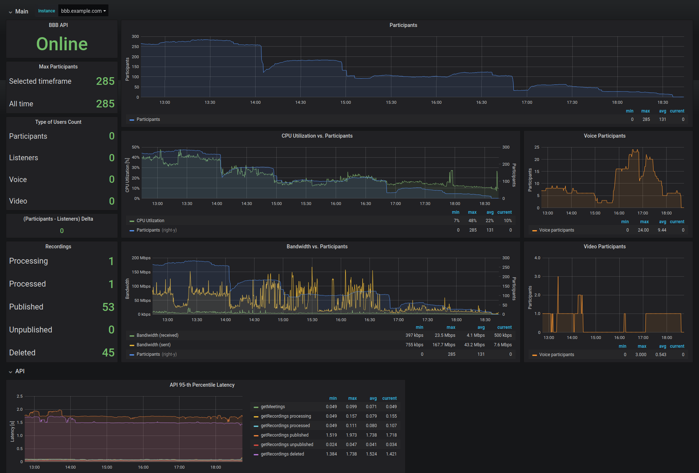
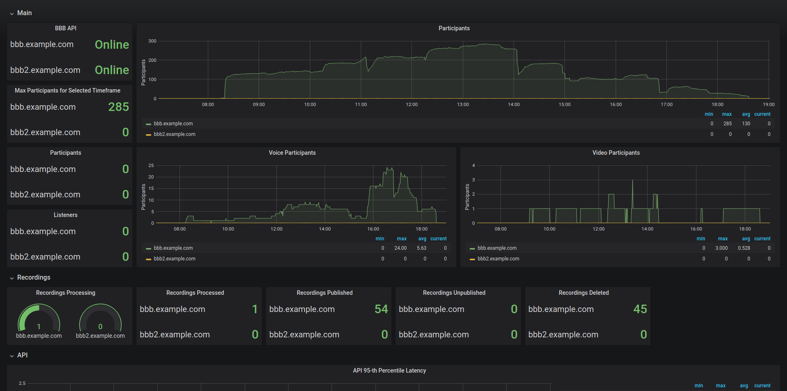

# BigBlueButton Exporter
Prometheus exporter for BigBlueButton.


Docker container image: [https://hub.docker.com/r/greenstatic/bigbluebutton-exporter](https://hub.docker.com/r/greenstatic/bigbluebutton-exporter)

Default port: 9688
## Grafana Dashboard
To import the customized dashboards, select the create button on the left hand side of Grafana and select __import__ then copy/paste the contents of the dashboard's JSON (see bellow for the path of the file).

### Server Instance Dashboard
Using the instance variable (top left corner) one can select a specific BigBlueButton server and view detailed metrics.
**Netdata is required** to view CPU & network bandwidth data.
See [Using Netdata with Prometheus](https://docs.netdata.cloud/backends/prometheus/) for details on how to set it up.

Dashboard is available at: `extras/grafana_dashboard_server_instance.json`



### All Servers Dashboard
Shows aggregated data for all BigBlueButton servers.

Dashboard is available at: `extras/grafana_dashboard_all_servers.json`



## Installation
The following instructions will instruct you how to install bbb-exporter on your BigBlueButton server and
direct `/metrics/` to expose your BBB server's metrics.

1. On your BigBlueButton server create directory bbb-exporter: 
   ```bash
   $ mkdir ~/bbb-exporter
   ```
1. Copy `extras/docker-compose.yml` to your BigBlueButton server to `~/bbb-exporter/docker-compose.yml`
1. Create the file `~/bbb-exporter/secrets.env` and enter the following
    ```
    # The following information can be found by running: bbb-conf --secret
    # Base URL has /api/ trailing the URL parameter returned by bbb-conf --secret, eg. https://example.com/bigbluebutton/api/
    API_BASE_URL=<BigBlueButton API URL>
    API_SECRET=<BigBlueButton secret>
    ```
1. Start the container:
    ```bash
    # You can replease `latest` with a docker image tag, check docker hub for available tags, link is above.
    $ sudo BBB_EXPORTER_VERSION=latest docker-compose up -d
    ```
1. Add a location directive to your Nginx web server (/etc/nginx/sites-available/bigbluebutton), example is bellow:
    ```
    # BigBlueButton Exporter (metrics)
    location /metrics/ {
      proxy_pass         http://127.0.0.1:9688/;
      proxy_redirect     default;
      proxy_set_header   X-Forwarded-For   $proxy_add_x_forwarded_for;
      client_max_body_size       10m;
      client_body_buffer_size    128k;
      proxy_connect_timeout      90;
      proxy_send_timeout         90;
      proxy_read_timeout         90;
      proxy_buffer_size          4k;
      proxy_buffers              4 32k;
      proxy_busy_buffers_size    64k;
      proxy_temp_file_write_size 64k;
      include    fastcgi_params;
    }
    ```
1. Reload Nginx: `sudo systemctl reload nginx`
1. Try accessing `/metrics` on your web server

It is advised to add HTTP Basic Auth to the metrics endpoint and configure Prometheus to use the credentials.
This way metrics will not be exposed for everybody to see.


## Metrics
Gauges:
* bbb_meetings_participants - Total number of participants in all BigBlueButton meetings
* bbb_meetings_listeners - Total number of listeners in all BigBlueButton meetings
* bbb_meetings_voice_participants - Total number of voice participants in all BigBlueButton meetings
* bbb_meetings_video_participants - Total number of video participants in all BigBlueButton meetings
* bbb_recordings_processing - Total number of BigBlueButton recordings processing
* bbb_recordings_processed - Total number of BigBlueButton recordings processed
* bbb_recordings_published - Total number of BigBlueButton recordings published
* bbb_recordings_unpublished - Total number of BigBlueButton recordings unpublished
* bbb_recordings_deleted - Total number of BigBlueButton recordings deleted
* bbb_api_up - 1 if BigBlueButton API is responding 0 otherwise

Histograms:
* bbb_api_latency(labels: endpoint, parameters) - BigBlueButton API call latency
    * buckets: .01, .025, .05, .075, .1, .25, .5, .75, 1.0, 1.25, 1.5, 1.75, 2.0, 2.5, 5.0, 7.5, 10.0, INF
    
## Environment Variables
Add these to the `docker-compose.yml` file, see [https://docs.docker.com/compose/compose-file/#environment](https://docs.docker.com/compose/compose-file/#environment)
for instructions how.

* API_SECRET - BigBlueButton API Secret
    * **Required: true**
    * Use `$ bbb-conf --secret` on BigBlueButton server to get secret and Base API url
* API_BASE_URL - 
    * **Required: true**
    * Example: "https://example.com/bigbluebutton/api/"
    * Trailing slash is required!
* DEBUG 
    * Required: false
    * Default: false
    * Values: <true | false>
* PORT
    * Required: false
    * Default: 9688
    * Values: <1 - 65535>
* SLEEP_DURATION - sleep duration between scraping API calls
    * Required: false
    * Default: 5
    * Values: <0 - > 
    
## Extras
Located in `extras` dir:
* docker-compose YAML file for bigbluebutton-exporter
* Grafana dashboards
